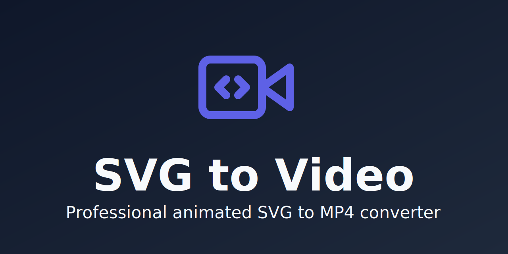

# SVG to Video

[](https://github.com/GehDoc/svg-to-video/actions/workflows/ci.yml)
[](https://opensource.org/licenses/MIT)
[](https://github.com/GehDoc/svg-to-video/releases)



A high-fidelity tool to render CSS-animated SVGs into high-quality videos including MP4, WebM, MKV, MOV, and more.

Unlike standard converters that struggle with complex CSS keyframes or transitions, this project provides a unified engine to scrub through the Web Animations API, ensuring every frame is captured exactly as the browser renders it.

## 🌟 Why SVG to Video?

- **Privacy-First**: The Web Studio runs entirely in your browser using **WebCodecs**—your SVG files never leave your computer.
- **Frame-Accurate**: Our engine scrubs the **Web Animations API**, ensuring every frame is captured exactly as rendered.
- **Transparent Backgrounds**: Export your animations with a full alpha channel using WebM, perfect for overlays in video editing tools like Premiere or DaVinci Resolve.
- **Versatile**: Whether you need an accessible [Web Studio](#web-studio) for quick conversions or a powerful [CLI tool](#cli--docker-tool) for batch automation and CI/CD pipelines, this project has you covered.

## 🌐 Web Studio

**[🚀 Try the Web Studio](https://gehdoc.github.io/svg-to-video/)**

Our **Web Studio** is a serverless, client-side rendering tool. It runs entirely in your browser using **WebCodecs**—your SVG files never leave your computer, ensuring absolute privacy.

> **Privacy Note**: We use [Umami Analytics](https://umami.is/) to collect anonymous usage data (e.g., number of conversions) to help us improve the tool. This tracking is cookie-less, respects "Do Not Track" settings, and never collects personal information.

Explore our **[Visual Gallery (Storybook)](https://gehdoc.github.io/svg-to-video/storybook/)** to see how the engine handles complex CSS and fonts.

### Quick Start

1. Open the [Web Studio](https://gehdoc.github.io/svg-to-video/).
2. Drag and drop your `.svg` file.
3. Adjust resolution, duration, and FPS.
4. Select your format, toggle **Transparent Background** if needed, and ensure **High-Fidelity Capture** is enabled for best results.
5. Click **Export**.

---

## 🚀 CLI / Docker Tool

For automated or batch processing, use the CLI tool. It is built to run in a headless environment, making it perfect for CI/CD pipelines or server-side automation.

### Quick Start

Ensure [Node.js](https://nodejs.org/) and [FFmpeg](https://ffmpeg.org/) are installed.

```bash
npm install
node src/index.js example.svg 5 60 output.mp4
```

### Docker Usage

If you prefer an isolated environment:

```bash
docker compose build
docker compose run --rm svg-to-video example.svg 5 60 output.mp4
```

## 🛠 Features

- **Frame-Accurate Rendering**: Uses Puppeteer (CLI) or WebCodecs (Web) to scrub through the Web Animations API.
- **Smart Duration Detection**: Automatically detects the original duration of SVG animations (SMIL and CSS) upon loading in the Web Studio.
- **Multiple Formats**: Export to high-quality MP4, WebM, MKV, MOV, and other browser-supported containers via dynamic discovery.
- **Transparency Support**: Capture the full alpha channel for transparent video overlays (supported formats include WebM, MKV).
- **High-Fidelity Capture**: Handles external fonts and images with robust pre-flight asset checks.
- **Production-Ready**: A hardened Docker environment and automated CI/CD pipeline.

## 📖 CLI Usage

```bash
node src/index.js <svgPath> <duration> <fps> <outDir> [options]
```

### Arguments

| Argument   | Description                         |
| ---------- | ----------------------------------- |
| `svgPath`  | Path to the input `.svg` file.      |
| `duration` | Animation length in seconds.        |
| `fps`      | Frames per second (e.g., 60).       |
| `outDir`   | Directory to save frames and video. |

### Options

| Option                  | Description                                                                                          |
| ----------------------- | ---------------------------------------------------------------------------------------------------- |
| `-h, --hold <seconds>`  | Number of seconds to freeze the last frame at the end of the video. (Default: `0`)                   |
| `-f, --force`           | Overwrite the output video if it already exists.                                                     |
| `--resolution <preset>` | Resolution preset: `720p`, `1080p`, or `original`. (Default: `original`)                             |
| `--scale <number>`      | Scale factor for original resolution (1-4). (Default: `1`) - Only used with `--resolution original`. |
| `--transparent`         | Render with a transparent background. (Cannot be used with `--bg-color`)                             |
| `--bg-color <hex>`      | Background color for the video. (Default: `#ffffff`) - (Cannot be used with `--transparent`)         |
| `--keep-frames`         | Prevents the automatic deletion of temporary `.png` frames after video creation.                     |

### Environment Variables

| Variable         | Scope   | Description                                                                                                                                       |
| ---------------- | ------- | ------------------------------------------------------------------------------------------------------------------------------------------------- |
| `PUPPETEER_ARGS` | Runtime | Additional arguments passed directly to the Puppeteer `launch` method. Useful for custom browser flags (e.g., `--proxy-server`, `--disable-gpu`). |

### Output Handling

The tool creates the video in the specified `<outDir>`. The filename will match your input file. By default, it will **fail** if the destination file already exists to prevent accidental overwrites. Use `-f` to bypass this.

- **Input:** `my-animation.svg`
- **Result:** `./out-dir/my-animation.mp4`

## 🤝 Contributing

Contributions are welcome! Please open an issue or pull request.
For instructions on contributing, build commands, and the technical roadmap, please see [CONTRIBUTING.md](./CONTRIBUTING.md).

## 🛠 Technical Details

For a deep dive into the rendering engine, algorithms, and infrastructure, see [docs/ARCHITECTURE.md](./docs/ARCHITECTURE.md).

The tool works by:

1. **Isolation**: Loading the SVG into a headless browser or isolated iframe.
2. **Scrubbing**: Pausing the animation and manually incrementing `currentTime`.
3. **Capture**: Taking a high-resolution snapshot for every frame, with optional alpha channel support.
4. **Encoding**: Using WebCodecs (Web) or FFmpeg (CLI) to compile the frames into a high-quality video file.

## 📜 License

This project is licensed under the **MIT License**.
