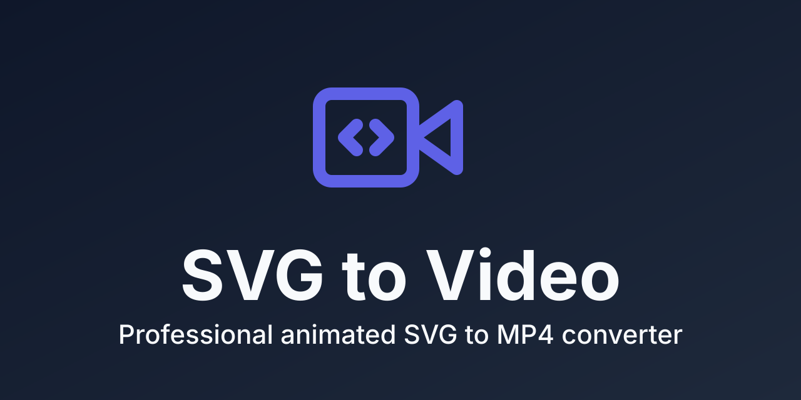

<div align="center">
  
</div>

# SVG to Video

[](https://github.com/GehDoc/svg-to-video/actions/workflows/ci.yml)
[](https://github.com/GehDoc/svg-to-video/releases)
[](https://www.npmjs.com/package/@gehdoc/svg-to-video)
[](https://hub.docker.com/r/gehdoc/svg-to-video)
[](https://github.com/GehDoc/svg-to-video/commits/main)

A high-fidelity tool to transform your CSS-animated SVGs into high-quality videos (MP4, WebM, MKV, MOV) or lightweight animated formats (aPNG, GIF) with perfect alpha-channel transparency directly in your browser or via CLI/MCP server.

<div align="center">
  <a href="https://gehdoc.github.io/svg-to-video/"></a>
  <p><i>Automated demo generated by our CI/CD pipeline</i></p>
</div>

---

## 🌟 Why SVG to Video?

- **Transparent Backgrounds**: Export your animations with a full alpha channel using **WebM or aPNG**, and optimized indexed transparency with **GIF89a**. Perfect for overlays in video editing tools or web use.
- **Privacy-First**: The Web Studio runs entirely in your browser—your SVG files never leave your computer.
- **Frame-Accurate**: Our engine scrubs the **Web Animations API**, ensuring every frame is captured exactly as rendered.
- **AI Agent Native**: Native **Model Context Protocol (MCP)** server and **Agent Skill (`SKILL.md`)** support to let AI assistants render their generated SVG animations into MP4/GIF automatically.
- **Universal Animated Formats**: Beyond video, generate lightweight **Animated PNGs (aPNG)** and **GIFs** perfect for documentation, Slack, or GitHub, with full control over background transparency.
- **Copy to Clipboard**: Instant export to **Base64 Data URL**—copy your video and embed it directly into your HTML, CSS, or JS code without manual downloads. Perfect for rapid prototyping and developers.
- **Metadata Injection**: Support for custom titles and comments across video (MP4, WebM, MKV, MOV) and animated image (aPNG, GIF) formats.
- **Versatile**: Whether you need an accessible [Web Studio](#-web-studio) for quick conversions or a powerful [CLI tool](#-cli--docker-tool) for batch automation and CI/CD pipelines, this project has you covered.

---

## 🚀 Getting Started

Choose the entry point that matches your needs:

- **[Web Studio](https://gehdoc.github.io/svg-to-video/)**: The easiest way to convert SVGs to video, **high-fidelity aPNG, or optimized GIF** in your browser without any installation.
- **[CLI / Docker Tool](#-cli--docker-tool)**: For batch processing, server-side automation, and CI/CD integration.
- **[AI Agent & MCP Server](#-ai-agent--mcp-integration)**: For Claude Desktop, Cursor, Antigravity, and autonomous LLM workflows.

---

## 🌐 Web Studio

**[🚀 Try the Web Studio](https://gehdoc.github.io/svg-to-video/)**

Our **Web Studio** is a serverless, client-side rendering tool. It runs entirely in your browser using **WebCodecs**—your SVG files never leave your computer, ensuring absolute privacy. The interface is optimized for high-productivity on screens starting from **720p resolution**.

> **Automated Demo**: The demo video at the top of this README is automatically generated and updated by our CI/CD pipeline using Playwright and Driver.js, ensuring it always reflects the latest UI changes.

> **Privacy Note**: We use [Umami Analytics](https://umami.is/) to collect anonymous usage data across our Web Studio, CLI, and MCP server interfaces (e.g., number of conversions and format usage) to help us improve the tool. This tracking is cookie-less, respects standard "Do Not Track" settings (`DO_NOT_TRACK=1`), and never collects personal information or SVG contents. See **[docs/ANALYTICS.md](./docs/ANALYTICS.md)** for details.

Explore our **[Visual Gallery (Storybook)](https://gehdoc.github.io/svg-to-video/storybook/)** to see how the engine handles complex CSS and fonts.

### Quick Start

1. Open the [Web Studio](https://gehdoc.github.io/svg-to-video/).
2. Drag and drop your `.svg` file.
3. Adjust resolution, duration, and FPS.
4. Select your format, toggle **Transparent Background** if needed, and ensure **High-Fidelity Capture** is enabled for best results.
5. Click **Export**.

---

## 🚀 CLI / Docker Tool

For automated or batch processing, use the CLI tool. It is built to run in a headless environment, making it perfect for CI/CD pipelines or server-side automation.

### Quick Start

Ensure [Node.js](https://nodejs.org/) and [FFmpeg](https://ffmpeg.org/) are installed.

```bash
# Node.js (auto-detected duration)
npx @gehdoc/svg-to-video input.svg 60 ./out-dir

# Node.js (explicit duration & GIF output)
npx @gehdoc/svg-to-video input.svg 60 ./out-dir -d 5 --format gif --transparent

# Node.js (animated PNG output)
npx @gehdoc/svg-to-video input.svg 60 ./out-dir -d 5 --format apng

# Docker (zero local dependencies; add :Z to -v for SELinux / Fedora)
docker run --rm -v $(pwd):/data:Z gehdoc/svg-to-video /data/input.svg 60 /data/out-dir -d 5 --format gif
```

See [docs/CLI.md](./docs/CLI.md) for full usage, arguments, and options.

---

## 🤖 AI Agent & MCP Integration

Connect `svg-to-video` to AI Assistants (Claude Desktop, Cursor, Antigravity, AutoGPT) via Model Context Protocol:

1. **Add to `mcpServers` config**:
   ```json
   {
     "mcpServers": {
       "svg-to-video": {
         "command": "npx",
         "args": ["-y", "@gehdoc/svg-to-video", "mcp"]
       }
     }
   }
   ```
2. **Prompt your AI Assistant**:
   > _"Convert `examples/example.svg` into a 60fps transparent WebM video."_

See **[docs/MCP.md](./docs/MCP.md)** for full setup instructions, tool schemas, Docker execution, and agent prompting guides.

---

## 🔗 Official Package Distributions

- 📦 **npm Package**: [`@gehdoc/svg-to-video`](https://www.npmjs.com/package/@gehdoc/svg-to-video)
- 🐳 **Docker Hub Image**: [`gehdoc/svg-to-video`](https://hub.docker.com/r/gehdoc/svg-to-video)
- 🌐 **Web Studio**: [`gehdoc.github.io/svg-to-video/`](https://gehdoc.github.io/svg-to-video/)

---

## 📦 Quick Installation & Execution

```bash
# Run on-demand via npx (no global installation required)
npx @gehdoc/svg-to-video input.svg 60 ./out-dir

# Install globally via npm
npm install -g @gehdoc/svg-to-video

# Pull official Docker image from Docker Hub
docker pull gehdoc/svg-to-video:latest
```

---

## 🛠 Technical Details

For a deep dive into the rendering engine, algorithms, and infrastructure, see [docs/ARCHITECTURE.md](./docs/ARCHITECTURE.md).

The tool works by isolating the SVG, scrubbing the Web Animations API, and capturing frames via WebCodecs or FFmpeg.

---

## 🤝 Contributing

Contributions are welcome! This project follows a **Spec-Driven Development (SDD)** workflow to ensure clear requirements and high quality. Please open an issue or pull request.

Check out our [Active Roadmap](./specs/pending/) to see what we're working on next.

For instructions on contributing, build commands, security standards, and the technical roadmap, please see [CONTRIBUTING.md](./CONTRIBUTING.md).

---

## 💖 Support the Project

If you find this tool helpful, please consider supporting its development:

[](https://paypal.me/GehDoc)

Your support helps cover maintenance and further development of the tool. Thank you!

---

## 📜 License

This project is licensed under the **MIT License**.
